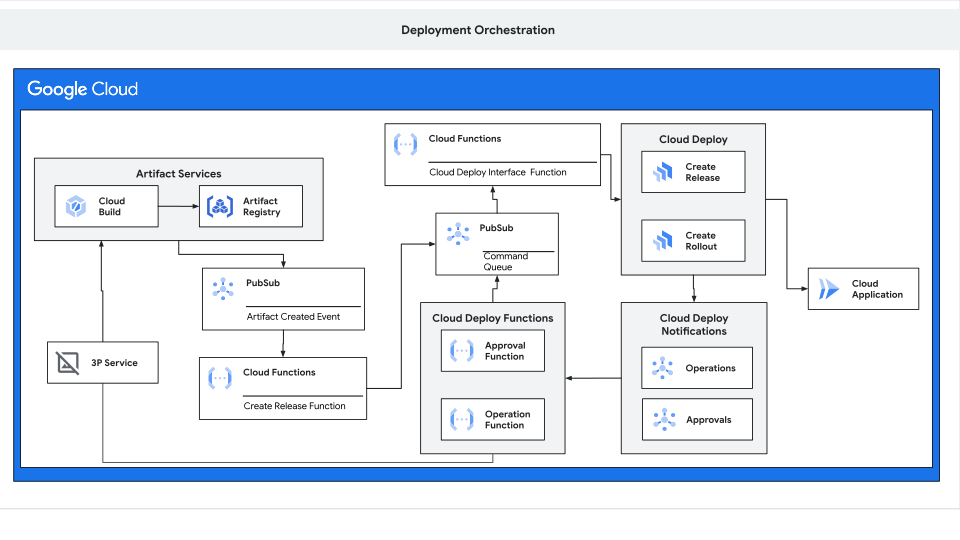

# Platform Engineering Deployment Demo

## Background

Platform engineering focuses on providing a robust framework for managing the
deployment of applications across various environments. One of the critical
components in this field is the automation of application deployments, which
streamlines the entire process from development to production.

Most organizations have predefined rules around security, privacy, deployment,
and change management to ensure consistency and compliance across environments.
These rules often include automated security scans, privacy checks, and
controlled release protocols that track all changes in both production and
pre-production environments.

In this demo, the architecture is designed to show how a deployment tool like
Cloud Deploy can integrate smoothly into such workflows, supporting both
automation and oversight. The process starts with release validation, ensuring
that only compliant builds reach the release stage. Rollout approvals then offer
flexibility, allowing teams to implement either manual checks or automated
responses depending on specific requirements.

This setup provides a blueprint for organizations to streamline deployment
cycles while maintaining robust governance. By using this demo, you can see how
these components work together, from container build through deployment, in a
way that minimizes disruption to existing processes and aligns with typical
organizational change management practices.

This demo showcases a complete workflow that begins with the build of a
container and progresses through various stages, ultimately resulting in the
deployment of a new application.

## Overview of the Demo

This demo illustrates the end-to-end deployment process, starting from the
container build phase. Here's a high-level overview of the workflow:

1.  **Container Build Process**: The demo begins when a container is built in
Cloud Build. Upon completion, a notification is sent to a Pub/Sub message queue.

2.  **Release Logic**: A Cloud Function subscribes to this message queue,
assessing whether a release should be created. If a release is warranted, a
message is sent to a "Command Queue" (another Pub/Sub topic).

3.  **Creating a Release**: A dedicated function listens to the "Command Queue"
and communicates with Cloud Deploy to create a new release. Once the release is
created, a notification is dispatched to the Pub/Sub Operations topic.

4.  **Rollout Process**: Another Cloud Function picks up this notification and
initiates the rollout process by sending a `createRolloutRequest` to the
"Command Queue."

5.  **Approval Process**: Since rollouts typically require approval, a
notification is sent to the `cloud-deploy-approvals` Pub/Sub queue. An approval
function then picks up this message, allowing you to implement your custom logic
or utilize the provided Website Demo to return JSON, such as
`{ "manualApproval": "true" }`.

6.  **Deployment**: Once approved, the rollout proceeds, and the new application
is deployed.



## Getting Started

To run this demo, follow these steps:

1.  **Fork and Clone the Repository**:
    Start by forking this repository to your GitHub account (So you can connect
    GCP to this repo), then clone it to your local environment. After cloning,
    change your directory to the deployment demo:

    ```bash
    cd platform-engineering/reference-architectures/cloud-deploy-flow
    ```

2.  **Set Up Environment Variables**:
   Define the environment variables of which details can be found in in
   [variables.tf](variables.tf) to match your Google Cloud project and GitHub configuration:

3.  **Initialize and Apply Terraform**:
    With the environment variables set, initialize and apply the Terraform configuration:

    ```bash
    terraform init
    terraform apply
    ```

    *Note*: Applying Terraform may take a few minutes as it creates the
    necessary resources.

4.  **Connect GitHub Repository to Cloud Build**:
    Due to occasional issues with automatic connections, you may need to manually
    attach your GitHub repository to Cloud Build in the Google Cloud Console.

    Re-run step 3 to ensure all resources are deployed

5.  **Navigate to the Demo Website**:
    Once the Terraform setup is complete, switch to the Demo Website directory:

    ```bash
    cd platform-engineering/reference-architectures/cloud-deploy-flow/WebsiteDemo
    ```

6.  **Authenticate and Run the Demo Website**:

    *   Set your Google Cloud project by running:

        ```bash
        gcloud config set project <your_project_id>
        ```

    *   Authenticate your Google Cloud CLI session:

        ```bash
        gcloud auth application-default login
        ```

    *   Install required npm packages and start the demo website:

        ```bash
        npm install
        node index.js
        ```

    *   Open `http://localhost:8080` in your browser to observe the demo
    website in action.

7.  **Trigger a Build in Cloud Build**:

    *   Initiate a build in Cloud Build. As the build progresses, messages will
    display on the demo website, allowing you to follow each step in the
    deployment process.
    *   You can also monitor the deployment rollout on [Google Cloud Console](https://console.cloud.google.com).

8.  **Approve the Rollout**:
    When an approval message is received, you’ll need to send a response to
    complete the deployment. Use the message data provided and add a
    `ManualApproval` field:

    ```text
    {
        "message": {
        "data": "<base64-encoded data>",
        "attributes": {
            "Action": "Required",
            "Rollout": "rollout-123",
            "ReleaseId": "release-456",
            "ManualApproval": "true"
        }
        }
    }
    ```

9.  **Verify the Deployment**:
   Once the approval is processed, the deployment should finish rolling out.
   Check the Cloud Deploy dashboard in the Google Cloud Console to confirm the
   deployment status.

## Conclusion

This demo encapsulates the essential components and workflow for deploying
applications using platform engineering practices. It illustrates how various
services interact to ensure a smooth deployment process.
